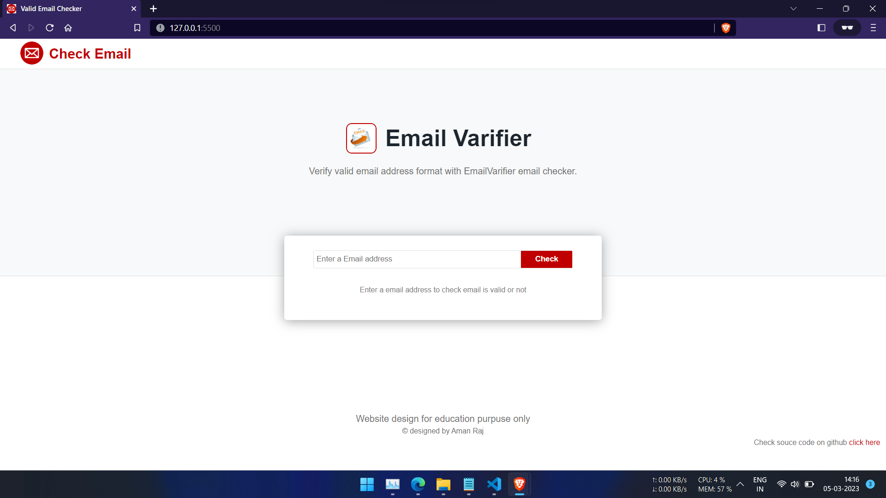
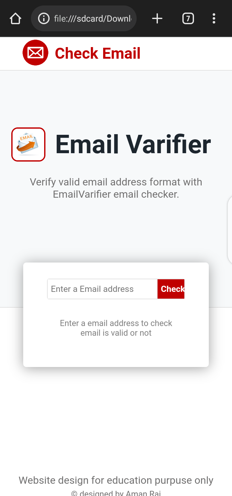

# Email verifier  
This is my first Project. In this project, an email input from the user is validated to ensure that it is in a valid format.

If a valid email format is entered, the output will be `You have entered a valid email address`

if the user inputs an invalid email format the output display an error.

---
## How to use

1. Open the Coder Calculator web app in your browser. [https://amanrajrana.github.io/email-verifier/](https://amanrajrana.github.io/email-verifier/)
2. Enter your Email

---

### Note:
1. There is no need for any backend for this project, it runs locally in a browser on the client.

2. The output of this project only checks for valid email formats. It does not guarantee that the email will exit.

## Technologies used
- **HTML5**
- **CSS**
- **JavaScript** 

## Screenshots
**Desktop Preview**

**Mobile Preview**

## 🛠 language
Javascript, HTML, CSS...

## Authors
**_Aman Raj Rana_**

## 🚀 About Me
I'm MERN stack developer...

